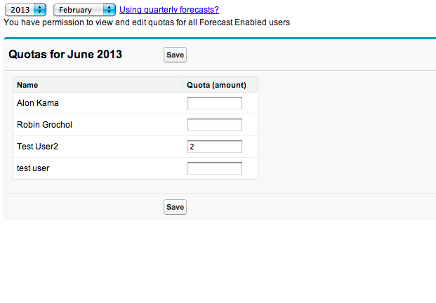

Edit Quotas
===========

UI for viewing and editing quotas for Collaborative Forecasting

Version 1.2 - 2013-09-03
------------------------

* Edit Quotas is a managed app for viewing and editing quotas. Check out the 
  AppExchange listing (here)[https://appexchange.salesforce.com/listingDetail?listingId=a0N3000000B41EqEAJ]. 
  
* Access to quotas is governed by the following:
  - Full read/write to all forecasts for those with View All Forecasts and 
    Manage Quotas perm
  - Full read/write to subordinate quotas only for those with Manage Quotas
    perm
  - Read only for subordinate quotas for those without the Manage Quotas perm
 
* For orgs with quarterly forecasts, a help message explains how to enter them 
  in the monthly view.
  
* Multicurrency orgs will show each quota's currency, with an option to change
  it to any of the currencies defined for the org. An empty quota row will 
  default the currency to that user's default currency.
  
* When there is no quota for a user for a given month, it'll appear as blank. 
  If left blank, pressing the save button won't add a quota for this user. But
  there is no option to delete a quota - removing the number from a previously-
  saved quota will store a 0 value.

* Partner users work just like regular org users

Known issues
------------
* In edit mode, quotas that are whole number quotas will appear with only one digit after the period, for example 
  USD 123.0 
  
