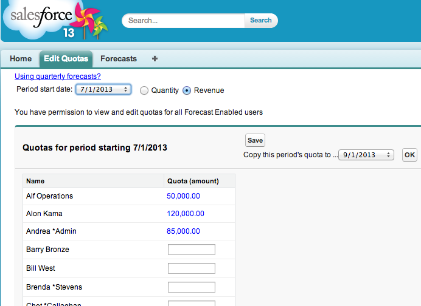

Edit Quotas - version 2.5 (2018-07-07)
===========

About
-----
UI for viewing and editing quotas for Collaborative Forecasting

Edit Quotas is a Salesforce.com managed app for viewing and editing quotas. Check out the AppExchange listing [here](https://appexchange.salesforce.com/listingDetail?listingId=a0N3000000B41EqEAJ). 

Installation instructions
-------------------------
 - Install this package from AppExchange for All Users
 - For the users you want to enable:
   - Check their Manage Quotas and View All Forecasts perm
   - Go to the Permission Set named 'Edit Quotas access' and assign it to the intended users

Security & Access
-----------------
 
Access to quotas is governed by the following:
  - Full read/write to all quotas for those with View All Forecasts and 
    Manage Quotas perm
  - Full read/write to subordinate quotas only for those with Manage Quotas
    perm
  - Read only for subordinate quotas for those without the Manage Quotas perm

What's New
----------
Version 2.3 is adapted for the Winter '17 release. 
 - Lightning UI
 - Displays forecast hierarchy as a tree, allows you to choose which roles' quotas to change
 - Permission Set for easily granting access to the app

